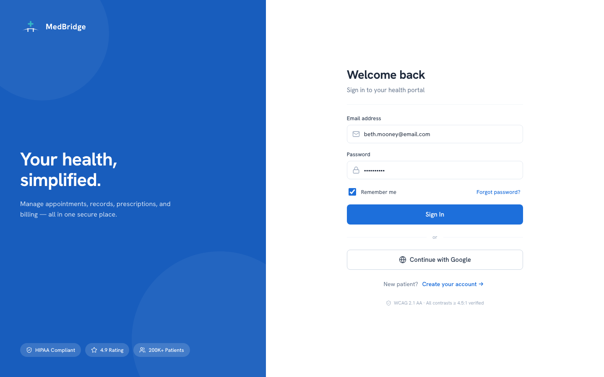
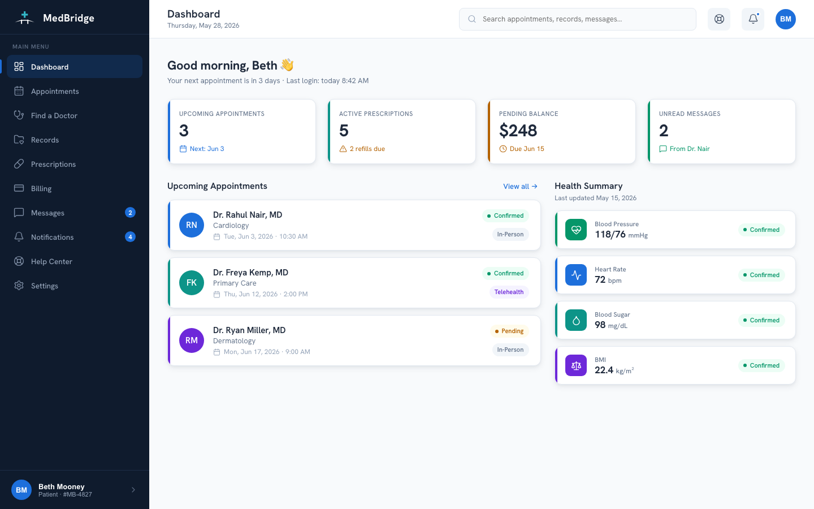
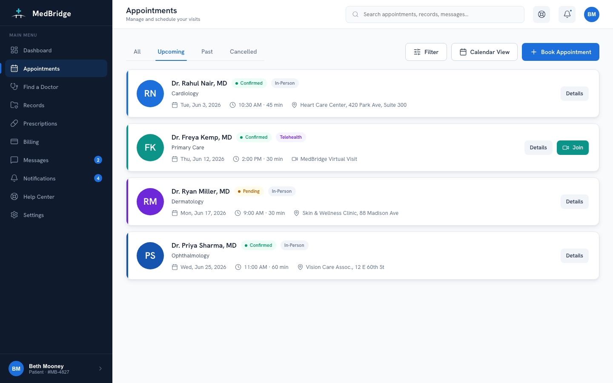
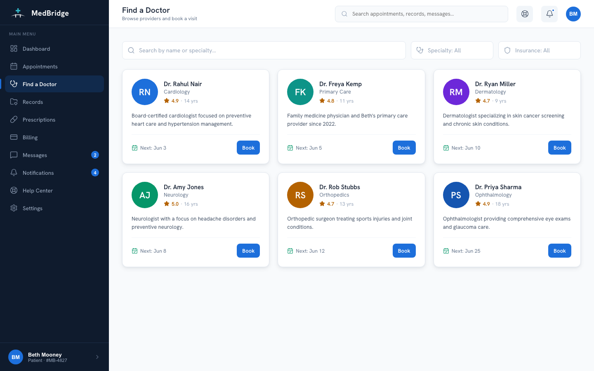
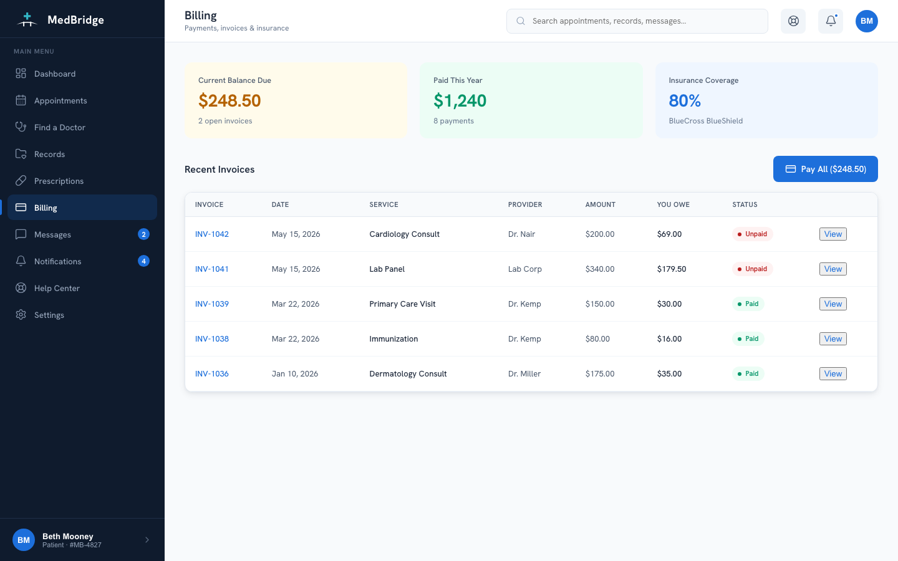
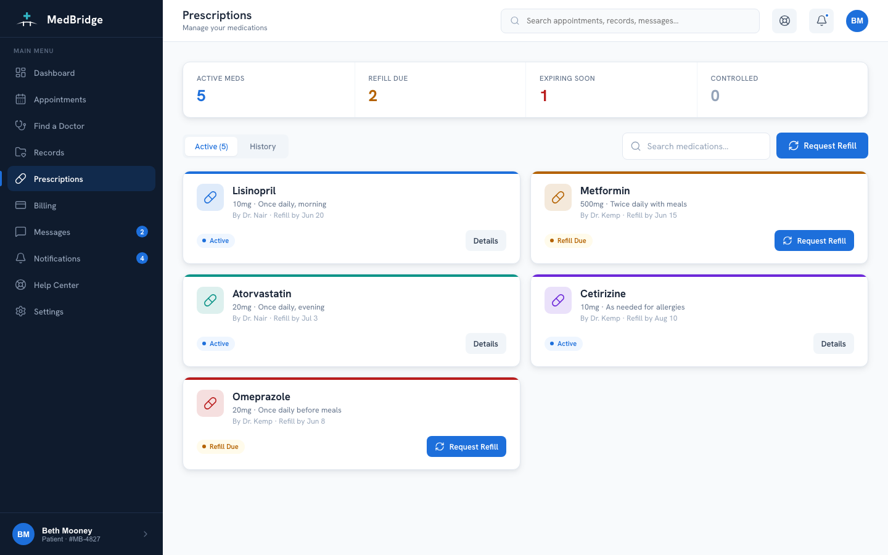

# MedBridge

Patient portal redesign: appointments, prescriptions, medical records, billing, and secure messaging in one interface. A design system and a 25+ screen interactive prototype, no build step.

**Live case study:** [naveensereddy.com/case-medbridge](https://naveensereddy.com/case-medbridge)

## Screenshots













## Features

- 25+ screens covering dashboard, appointments (list, calendar, booking flow), find-a-doctor with provider profiles, medical records (vitals, conditions, allergies, test results, timeline), prescriptions and refills, billing and invoices, messages, notifications, and settings
- A parallel mobile screen set (sign in, home, appointments, booking, prescriptions, messages) served under the same 600px breakpoint
- A hash-based router that also drives which screen set (desktop or mobile) loads first
- A floating screen directory (44 screens total) for jumping to any state directly, useful for review without clicking through the whole flow

## Tech stack

React 18.3 and Babel Standalone, both loaded from unpkg at runtime. No bundler, no package.json, no build step: open `index.html` and the browser transforms the JSX on the fly.

Styling is plain CSS custom properties in `colors_and_type.css` (color roles, spacing, radii, motion timing, type scale) and component classes in `components.css`. Icons come from Lucide, also loaded from a CDN and re-rendered via `lucide.createIcons()` after every screen change.

There's no backend. All patient, provider, appointment, and billing data is hardcoded in `lib.jsx` as plain JS objects and arrays.

## Project structure

```
ui_kits/portal/
  index.html      # entry point, loads all scripts in order
  lib.jsx         # mock data (patient, providers, appointments, prescriptions, invoices...) + icon/brand helpers
  ui.jsx          # shared UI primitives
  shell.jsx       # sidebar + top nav shell
  screens1-5.jsx  # desktop screens, grouped
  mobile.jsx      # mobile screen set
  app.jsx         # router: SCREENS map, hash-based navigation, screen directory
colors_and_type.css   # design tokens
components.css         # component classes built on the tokens
case-study/             # case-study artifact components (personas, journey map, wireframes, design system, accessibility audit, final UI) shown on the portfolio site
preview/                # design-system reference pages (colors, type, spacing, components in isolation)
docs/                   # research, IA, design decisions, engineering handoff
screenshots/            # screenshots used in this README
assets/                 # logo files
```

## Architecture

`app.jsx` holds a `SCREENS` object mapping route names to components, and reads the initial route from `location.hash` (falling back to a mobile or desktop login screen based on viewport width). Every screen component pulls its data straight from the arrays in `lib.jsx`, there's no fetch layer or async loading since everything's static and in-memory. Icon rendering has to be re-triggered manually after each screen swap because Lucide converts `<i data-lucide>` tags to SVG on mount, and React re-renders don't re-trigger that pass on their own.

## Why I built it this way

No build step was a deliberate choice: the whole point is that anyone can clone the repo and open `index.html` with zero setup. The tradeoff is real, in-browser Babel transform is slower than a compiled bundle, and it wouldn't scale past a prototype of this size. For 30-ish screens it's fine.

The sidebar is a deep navy (`#0F1B2D`) against a near-white page background (`#F8FAFC`). That contrast anchors the layout and keeps the content area feeling open rather than cramped. Typography is Hanken Grotesk, which reads friendlier than Inter at smaller sizes while staying legible in a medical context. Clinical values (blood pressure, vitals, lab results) use tabular figures so numbers stay optically aligned in tables.

## Accessibility

All text passes WCAG 2.1 AA contrast ratios, interactive elements have 44px minimum touch targets, and focus states are visible by default rather than suppressed. There's a dedicated accessibility audit artifact in `case-study/cs-art-a11y.jsx` covering contrast ratios, tab order, and screen-reader labels for the dashboard specifically.

## Getting started

Open `ui_kits/portal/index.html` in any modern browser. No install, no build.

## Future improvements

- Move off in-browser Babel to a real build step (esbuild or Vite) if the screen count keeps growing, first paint would improve noticeably
- Extract the mock data in `lib.jsx` behind a small fetch-like interface so a real backend could swap in without touching screen components

## License

MIT

---

Naveen Sereddy · [github.com/Naveen-Sereddy](https://github.com/Naveen-Sereddy)
